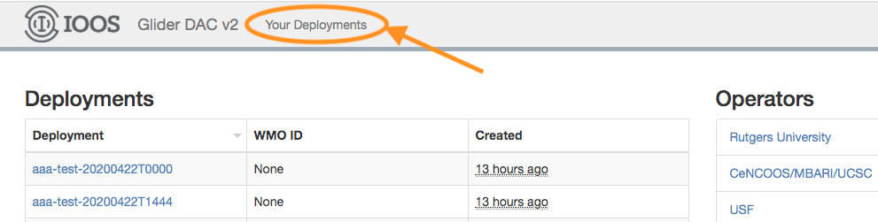
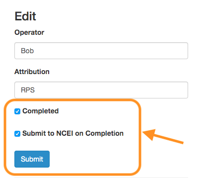

All additional questions or feedback should be directed to: 
[glider.dac.support@noaa.gov](mailto:glider.dac.support@noaa.gov?subject=GliderDAC%20Support)

A consolidated list of the links referenced below can be found [here](useful-links).


## Data Provider Registration

You must register as a data provider and receive a user account in order to contribute data sets to the **IOOS Glider Data Assembly Center**.  The following contact information is required:

 + Contact name
 + Contact institution (please see [special guidance on how to specify the institution name](ngdac-netcdf-file-format-version-2#institution))
 + Email address
 + Telephone number

and all user account requests should be emailed to: [glider.dac.support@noaa.gov](mailto:glider.dac.support@noaa.gov?subject=GliderDAC%20Support)

**New user accounts are typically created the same day they are received**.

## New Deployment Registration

Data providers can register deployments after the user account has been created.

If the deployment is current or in the future and you would like the data to be released on the **Global Telecommunication System (GTS)**, you must [request a WMO ID for the glider](#requesting-a-wmo-id).  This ID must be referenced as a [global attribute](ngdac-netcdf-file-format-version-2#description--examples-of-required-global-attributes) as well as an attribute of the file's [platform](ngdac-netcdf-file-format-version-2#platform) variable in each NetCDF file uploaded to the **NGDAC**.
  - **IMPORTANT**:
To enable NDBC to send a dataset to the GTS, the dataset must include a global attribute **gts_ingest** set to "true". NDBC then uses QARTOD flags as the primary method for determining which variables to exclude from GTS ingestion.

The next step is to register the deployment with the **NGDAC**.

### Requesting a WMO ID

A WMO ID is required to release real-time glider profiles to the [Global Telecommunication System](https://community.wmo.int/en/activity-areas/global-telecommunication-system-gts). Once assigned, a WMO ID remains valid for that glider regardless of its deployment region—if you have already received an ID for a vehicle, you may continue to use it anywhere in the world.  

**Submit new WMO ID requests to:**

<glider.dac.support@noaa.gov>

Required information (please supply in every request):
+ Program (your institution; NOT the project, as a glider can be used for multiple different projects over its lifetime)
+ Glider Model (e.g. Slocum G2, Spray, Seaglider)
+ Glider Serial number (manufacturer-assigned; do not substitute a call sign or glider name)
+ Approximate deployment date
+ Approximate deployment location (GPS coordinates)
+ Provider name

Recommended supplemental details:
+ Glider Name (informal label) 
+ Glider Call Sign (informal label)

**IMPORTANT:** always provide the manufacturer’s serial number as the sole authoritative ID for WMO requests to avoid conflicts and speed processing. If the serial number cannot be located, please explain why and provide your best alternative identifier; GDAC will reach out to confirm before issuing an ID.

**Process & Timeline:**

Upon receipt, the GDAC Team submits your WMO ID request to the [OceanOPS Request Identifiers Interface](https://www.ocean-ops.org/board?t=oceangliders), and you will typically receive your ID within one business day. Please use the GDAC’s centralized service (glider.dac.support@noaa.gov) rather than submitting directly via OceanOPS — direct submissions require US Glider DAC registration.

### Deployment Creation

Deployments are registered and managed via the [GliderDAC providers page](https://gliders.ioos.us/providers). Each deployment must be registered by the data provider **before** any NetCDF files are uploaded.  The deployment registration process is as follows:

1. Navigate to the [GliderDAC providers page](https://gliders.ioos.us/providers/) and login with your account credentials.
2. Click the **Your Deployments** link.  A deployment registration form will be displayed.



3. Enter the name of the glider and deployment date/time (ISO-8601) using the following convention:
    **YYYYmmddTHHMM**

    - where **YYYYmmddTHHMM** is the timestamp specifying  the start of the deployment.  This is also the value that should be assigned to the [trajectory](ngdac-netcdf-file-format-version-2#trajectory) variable in each NetCDF file that is submitted to NGDAC.  
    - **IMPORTANT**: This WMO ID must be included as the [global attribute](ngdac-netcdf-file-format-version-2#description--examples-of-required-global-attributes)  *wmo_id* as well as an attribute (*wmo_id*) of the file's [*platform*](ngdac-netcdf-file-format-version-2#platform) variable in each NetCDF file uploaded to the **NGDAC**.
    
4. An additional field, **attribution**, is also provided as a means for the data provider to acknowledge the funding agencies and/or funding source.

5. If the deployment is not current, select the **Delayed Mode?** checkbox. This will append "_delayed" to the deployment name, distinguishing **real-time (current)** data from **delayed (historical) data** for the same deployment.

6. Click **New Deployment** to create the deployment.  This creates a directory on the IOOS Glider DAC FTP server using the specified deployment name.  This is the directory that the NetCDF files must be uploaded to.

    **IMPORTANT: New deployments cannot be created by logging into the ftp server.  All new deployments must be created via the process described above.**

7. After the deployment has been registered, click on the deployment name to take you to the deployment metadata page and specify the **operator**.  Once the deployment has been completed (i.e.: the glider has been recovered or the deployment has been completed), click the **Completed** check box to denote that the data is ready for archiving by [NCEI](http://www.ncei.noaa.gov). See the [section below](ngdac-netcdf-file-submission-process#dataset-archiving) for more details on the NCEI archival process.

## Submission of NetCDF Files

The data provider user account provides ftp push access to the directories created under the user's home directory.  The ftp url is:

  `ftp://gliders.ioos.us`

Here's an example of the ftp login process and the resulting directory structure:

```
    $ ftp -i gliders.ioos.us
    Connected to gliders.ioos.us (54.204.42.247).
    220 Welcome to the IOOS Glider DAC FTP Server
    Name (gliders.ioos.us:kerfoot): rutgers
    331 Please specify the password.
    Password:
    230 Login successful.
    Remote system type is UNIX.
    Using binary mode to transfer files.
    ftp> pwd
    257 "/"
    ftp> dir
    200 PORT command successful. Consider using PASV.
    150 Here comes the directory listing.
    drwxr-xr-x    2 ftp      ftp         77824 Dec 08 16:40 ru01-20140104T1621
    drwxr-xr-x    2 ftp      ftp          4096 Dec 08 16:41 ru01-20140120T1444
    drwxr-xr-x    2 ftp      ftp         57344 Dec 08 16:41 ru01-20140123T1250
    drwxr-xr-x    2 ftp      ftp         65536 Dec 08 16:41 ru01-20140217T1244
    drwxr-xr-x    2 ftp      ftp         36864 Jan 15 16:07 ru05-20150105T1600
    drwxr-xr-x    2 ftp      ftp         65536 Feb 02 13:41 ru05-20150115T1443

    226 Directory send OK.
```

New NetCDF files should be uploaded to the directory [created above](#deployment-creation).  For example, uploading files to the *ru05-20150115T1443* deployment is done as follows:

```
    ftp> cd ru05-20150115T1443
    250 Directory successfully changed.
    ftp> lcd LOCAL_DIRECTORY
    Local directory now LOCAL_DIRECTORY
    ftp> mput *.nc
```

Please remember to use the [proper](ngdac-netcdf-file-format-version-2#file-naming-conventions) file naming convention.

The resulting deployment directory structure will look something like this:

```
    /ru05-20150115T1443
        profile1.nc
        profile2.nc
        profile3.nc
        ...
```

A generic [ftp script](https://raw.githubusercontent.com/ioos/ioosngdac/master/util/ncFtp2ngdac.pl), written in [Perl](http://www.perl.org/) is contained in the repository and may be used to upload the files to the **NGDAC**.  The script requires the following Perl non-core modules:
 + [Readonly](https://metacpan.org/pod/Readonly)
 + [Net::FTP](https://metacpan.org/pod/Net::FTP)

**You must specify your credentials in the $USER and $PASS variables contained in the script**.

## Dataset Status

Once one or more files have been successfully uploaded for the specified deployment, the [aggregation](ngdac-architecture#data-assembly-center-architecture) process begins.  As there are multiple file syncing and aggregation processes going on, it will take some time for the data access end points on both the [ERDDAP](https://gliders.ioos.us/erddap/tabledap/index.html) and [THREDDS](https://gliders.ioos.us/thredds/catalog.html) servers to be created and populated.  The end-to-end processing pathway **currently takes 1 - 2 hours**.  We are actively working on ways to decrease this time frame.

We've built a [dataset status](https://gliders.ioos.us/status/) page to provide administrators and users with the ability to track datasets through the end-to-end process.  The [home page](https://gliders.ioos.us/status/) displays a list of all data sets for which either/both the [ERDDAP](https://gliders.ioos.us/erddap/tabledap/index.html) and [THREDDS](https://gliders.ioos.us/thredds/catalog.html) are not yet available.  Please check this page before emailing the DAC administrators regarding data set availability.

## Dataset Archiving

Once a glider deployment is **completed** the data provider has the option to archive the dataset with the [National Centers for Environmental Information](https://www.ncei.noaa.gov/) national ocean archive.  **It is the responsibility of the data provider to mark the deployment as completed before the NCEI archival process begins**.

Here's how to mark a deployment as complete and submit the dataset to NCEI:

1. Navigate to the [GliderDAC providers page](https://gliders.ioos.us/providers/) and login with your account credentials.

2.Once logged


1. Select the deployment of interest from the table of deployments by clicking on the deployment name.

2. Under the **Edit** section on the right side of the deployment page, you'll see checkboxes for **Completed** and **Submit to NCEI on Completion**. Select both checkboxes and click the **Submit** button.



Once submitted, the [IOOS GliderDAC compliance checker](https://compliance.ioos.us/index.html) is run to check for compliance with the [current version of the IOOS Metadata Profile](https://ioos.github.io/ioos-metadata/ioos-metadata-profile-v1-2). The results of these checks will be emailed on completion. If any of these checks have failed, NCEI may not archive the deployment data until metadata issues are corrected.

## Modifying metadata after submission

In addition to resubmitting files with modified Metadata can be modified by
submitting an `extra_atts.json` file in the submission folder. Note that this will only
change metadata in the netCDF aggregation, not the submitted netCDF files themselves.

The file can change either global attributes with the `_global_attrs` key or variable names.
The attribute key and value are supplied below

### An example of metadata modification

```
{
  "global_attrs": {
     "title": "Glider deployment GX201, southwest of San Diego"
   },
   "temperature": {
     "standard_name": "sea_water_temperature",
     "long_name": "Temperature sensor"
   }
}
```

**NOTE:** ERDDAP uses the metadata from the latest file in a deployment to create an aggregation. So data providers only need to fix metadata on the latest file for the changes to be reflected in ERDDAP.