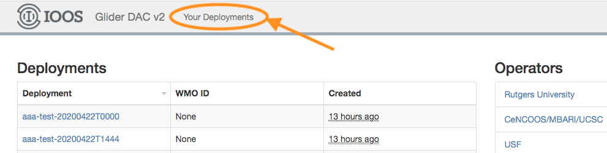
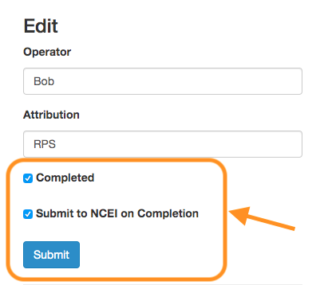
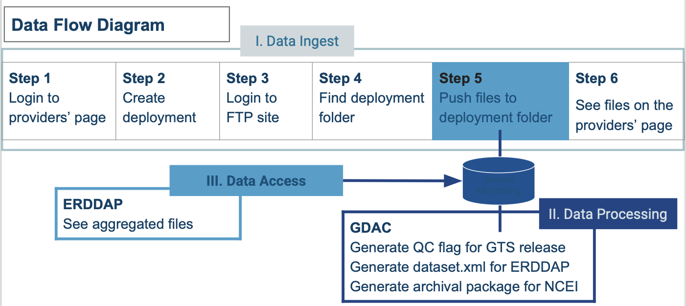

All additional questions or feedback should be directed to:
[glider.dac.support@noaa.gov](mailto:glider.dac.support@noaa.gov?subject=GliderDAC%20Support)

A consolidated list of the links referenced below can be found [here](useful-links).

A document summarizing the workflow that Registered Data Providers can follow to submit netCDF files to NGDAC is available in [Step-By-Step-File-Submission]({{ site.baseurl }}/step-by-step-file-submission.html)

## Data Provider Registration

You must register as a data provider and receive a user account in order to contribute data sets to the **IOOS Glider Data Assembly Center**.  The following contact information is required:

 + Contact name
 + Contact institution (please see [special guidance on how to specify the institution name](ngdac-netcdf-file-format-version-2#institution))
 + Email address
 + Telephone number

and all user account requests should be emailed to: [glider.dac.support@noaa.gov](mailto:glider.dac.support@noaa.gov?subject=GliderDAC%20Support)

**New user accounts are typically created the same day they are received**.

## New Deployment Registration

Data providers can register deployments after the user account has been created.

If the deployment is current or in the future and you would like the data to be released on the **Global Telecommunication System (GTS)**, you must [request a WMO ID for the glider](#requesting-a-wmo-id).  This ID must be referenced as a [global attribute](ngdac-netcdf-file-format-version-2#description--examples-of-required-global-attributes) as well as an attribute of the file's [platform](ngdac-netcdf-file-format-version-2#platform) variable in each NetCDF file uploaded to the **NGDAC**.
  - **IMPORTANT**:
To enable NDBC to send a dataset to the GTS, the dataset must include a global attribute **gts_ingest** set to "true". NDBC then uses QARTOD flags as the primary method for determining which variables to exclude from GTS ingestion.

The next step is to register the deployment with the **NGDAC**.

## Requesting a WMO ID

A WMO ID is required to release real-time glider profiles to the [Global Telecommunication System](https://community.wmo.int/en/activity-areas/global-telecommunication-system-gts). Once assigned, a WMO ID remains valid for that glider regardless of its deployment region—if you have already received an ID for a vehicle, you may continue to use it anywhere in the world.

**Submit new WMO ID requests to:**

<glider.dac.support@noaa.gov>

Required information (please supply in every request):
+ Program (your institution; NOT the project, as a glider can be used for multiple different projects over its lifetime)
+ Glider Model (e.g. Slocum G2, Spray, Seaglider)
+ Glider Serial number (manufacturer-assigned; do not substitute a call sign or glider name)
+ Approximate deployment date
+ Approximate deployment location (GPS coordinates)
+ Provider name

Recommended supplemental details:
+ Glider Name (informal label)
+ Glider Call Sign (informal label)

**IMPORTANT:** always provide the manufacturer’s serial number as the sole authoritative ID for WMO requests to avoid conflicts and speed processing. If the serial number cannot be located, please explain why and provide your best alternative identifier; NGDAC will reach out to confirm before issuing an ID.

**Process & Timeline:**

Upon receipt, the NGDAC Team submits your WMO ID request to the [OceanOPS Request Identifiers Interface](https://www.ocean-ops.org/board?t=oceangliders), and you will typically receive your ID within one business day. Please use the NGDAC’s centralized service (glider.dac.support@noaa.gov) rather than submitting directly via OceanOPS — direct submissions require US Glider DAC registration.

## Deployment Creation

Deployments are registered and managed via the [GliderDAC providers page](https://gliders.ioos.us/providers). Each deployment must be registered by the data provider **before** any NetCDF files are uploaded.  The deployment registration process is as follows:

1. Navigate to the [GliderDAC providers page](https://gliders.ioos.us/providers/) and login with your account credentials.

2. Click the **Your Deployments** link.  A deployment registration form will be displayed.



3. Enter the name of the glider and deployment date/time (ISO-8601) using the following convention:
    **YYYYmmddTHHMM**

    - where **YYYYmmddTHHMM** is the timestamp specifying  the start of the deployment.  This is also the value that should be assigned to the [trajectory](ngdac-netcdf-file-format-version-2#trajectory) variable in each NetCDF file that is submitted to NGDAC.
    - **IMPORTANT**: This WMO ID must be included as the [global attribute](ngdac-netcdf-file-format-version-2#description--examples-of-required-global-attributes)  *wmo_id* as well as an attribute (*wmo_id*) of the file's [*platform*](ngdac-netcdf-file-format-version-2#platform) variable in each NetCDF file uploaded to the **NGDAC**.

4. An additional field, **attribution**, is also provided as a means for the data provider to acknowledge the funding agencies and/or funding source.

5. If the deployment is not current, select the **Delayed Mode?** checkbox. This will append "_delayed" to the deployment name, distinguishing **real-time (current)** data from **delayed (historical) data** for the same deployment.

6. Click **New Deployment** to create the deployment.  This creates a directory on the IOOS Glider DAC FTP server using the specified deployment name.  This is the directory that the NetCDF files must be uploaded to.

    **IMPORTANT: New deployments cannot be created by logging into the ftp server.  All new deployments must be created via the process described above.**

7. After the deployment has been registered, click on the deployment name to take you to the deployment metadata page and specify the **operator**.  Once the deployment has been completed (i.e.: the glider has been recovered or the deployment has been completed), click the **Completed** check box to denote that the data is ready for archiving by [NCEI](http://www.ncei.noaa.gov). See the [section below](ngdac-netcdf-file-submission-process#dataset-archiving) for more details on the NCEI archival process.

## Submission of NetCDF Files

The data provider user account provides ftp push access to the directories created under the user's home directory.  The ftp url is:

  `ftp://gliders.ioos.us`

Here's an example of the ftp login process and the resulting directory structure:

```
    $ lftp -u user -e "set ftp:ssl-force true; set ftp:ssl-protect-data true" gliders.ioos.us
    Password:
    lftp user@gliders.ioos.us:~> ls
    drwxrwxr-x    2 ftp      ftp          4096 Jul 12  2024 user-20240527T0000
    drwxrwxr-x    2 ftp      ftp          4096 Jul 12  2024 user-20240711T0000
```

New NetCDF files should be uploaded to the directory [created above](#deployment-creation).  For example, uploading files to the example *user-20240527T0000* deployment is done as follows:

```
    lftp user@gliders.ioos.us:/> cd user-20240527T0000/
    lftp user@gliders.ioos.us:/user-20240527T0000> ls
    -rw-r--r--    1 ftp      ftp           615 May 28  2024 deployment.json
    lftp user@gliders.ioos.us:/user-20240527T0000> lcd /mydir
    lcd ok, local cwd=/mydir
    lftp user@gliders.ioos.us:/user-20240527T0000> mput *.nc
```

Please remember to use the [proper](ngdac-netcdf-file-format-version-2#file-naming-conventions) file naming convention.

The resulting deployment directory structure will look something like this:

```
    /ru05-20150115T1443
        profile1.nc
        profile2.nc
        profile3.nc
        ...
```

A generic [ftp script](https://raw.githubusercontent.com/ioos/ioosngdac/master/util/ncFtp2ngdac.pl), written in [Perl](http://www.perl.org/) is contained in the repository and may be used to upload the files to the **NGDAC**.  The script requires the following Perl non-core modules:
 + [Readonly](https://metacpan.org/pod/Readonly)
 + [Net::FTP](https://metacpan.org/pod/Net::FTP)

**You must specify your credentials in the $USER and $PASS variables contained in the script**.


## Datasets QARTOD Additions

When NetCDF profile files are submitted to the **NGDAC**, they are automatically processed using **Quality Assurance/Quality Control of Real-Time Oceanographic Data (QARTOD)** tests. These standardized tests evaluate the quality of key geophysical variables and document the results within each file.

The file you submit will include new Quality Control (QC) flag variables for each tested geophysical variable. These variables record the results of individual QARTOD tests and provide an overall primary QC result.

The following QC flag variables may be added:
```
- qartod_<variable>_gross_range_flag
- qartod_<variable>_spike_flag
- qartod_<variable>_rate_of_change_flag
- qartod_<variable>_flat_line_flag
- qartod_<variable>_primary_flag
```

A document giving more details on what happens to your file during the automated QC process is available in [NetCDF-QARTOD-GDAC-What-To-Expect]({{ site.baseurl }}/netcdf-qartod-gdac-what-to-expect.html).

## Dataset Access

Once one or more files have been successfully uploaded for the specified deployment, the [aggregation](ngdac-architecture#data-assembly-center-architecture) process begins.  As there are multiple file syncing and aggregation processes going on, it will take some time for the data access end points on both the [ERDDAP](https://gliders.ioos.us/erddap/tabledap/index.html) and [THREDDS](https://gliders.ioos.us/thredds/catalog.html) servers to be created and populated.  The end-to-end processing pathway **currently takes 1 - 2 hours**.  We are actively working on ways to decrease this time frame.

## Dataset Status

The [dataset status](https://gliders.ioos.us/status/) page has been deprecated and will be replaced by a new tool that enables administrators and users to track datasets throughout the end-to-end process. In the interim, the [Providers page](https://gliders.ioos.us/providers/) and the [ERDDAP Status](https://gliders.ioos.us/erddap/status.html) page offer limited but useful information about dataset status. You can also email the NGDAC administrators (glider.dac.support@noaa.gov) regarding dataset availability.

## Dataset Archiving

#### 1. Mark the Deployment as Completed
Once a glider deployment is **complete**, the data provider can request that the dataset be archived by the National Centers for Environmental Information ([NCEI](https://www.ncei.noaa.gov/)). **The data provider is responsible for marking the deployment as completed and selecting the NCEI archival option before the archival workflow begins**.

To mark a deployment as complete and request NCEI archival:

1. Navigate to the GliderDAC Providers page and log in with your account credentials.

2. On the Deployments page, select the deployment of interest by clicking its name.
  

3. In the Edit section on the right side of the deployment page, select both:
  - Completed
  - Submit to NCEI on Completion

4. Click Submit.
  

Selecting Completed creates the completion record used by downstream processing. Selecting Submit to NCEI on Completion indicates that the deployment should be considered for NCEI archival after it satisfies the required checks.

#### 2. Run the Compliance Checker
After the deployment is submitted, the IOOS GliderDAC compliance checker runs against the deployment data retrieved from ERDDAP. The check uses the configured GliderDAC3.0 checker with lenient criteria and reports results by priority, including High-, Medium-, and Low-priority issues. The compliance report and overall compliance status are stored for the deployment in the NGDAC database.

Detected high-priority CF Standard Name issues are displayed on the provider’s deployment page: append the link https://gliders.ioos.us/providers/ with the deployment/add_deployment_name.

#### 3. Prepare the Dataset for NCEI Archival
A deployment is prepared for NCEI archival only when it meets the archival eligibility requirements:

- The deployment is marked Completed.
- The deployment is marked for NCEI submission by selecting Submit to NCEI on Completion.
- The deployment passes the CF Standard Names requirement.


For eligible deployments, the archival process:

- Locates the aggregated NetCDF dataset.
- Places a symbolic link to the dataset in the NCEI staging directory.
- Creates or verifies a content-based MD5 checksum.
- Makes the staged dataset available for NCEI automation.

The archival script prepares and stages the dataset; it does not perform the final NCEI archival operation. NCEI automation is responsible for discovering the staged dataset and processing it for inclusion in the national ocean archive.

**Note**: Deployments that fail the high-priority CF Standard Names check are not prepared for submission to the NCEI National Ocean Archive. If a deployment is no longer eligible for archival, the archival workflow removes its dataset and checksum from the NCEI staging area and creates a .DO-NOT-ARCHIVE marker for NCEI automation.

The next section, **Modifying Metadata After Submission**, explains how to correct metadata so that the deployment passes the CF Standard Names check and can be prepared for NCEI archival.

## Dataset Correction

### Modifying Metadata After Submission

Metadata can be modified either by resubmitting files or by submitting an **extra_atts.json** file in the submission folder. Note that using **extra_atts.json** changes the metadata in the NetCDF aggregation only; it does not modify the submitted NetCDF files themselves.

The file can change either global attributes with the `_global_attrs` key or variable names.
The attribute key and value are supplied below

#### An example of metadata modification

```
{
  "global_attrs": {
     "title": "Glider deployment GX201, southwest of San Diego"
   },
   "temperature": {
     "standard_name": "sea_water_temperature",
     "long_name": "Temperature sensor"
   }
}
```

**NOTE:** ERDDAP uses metadata from the latest NetCDF file in a deployment when building the aggregated dataset. Therefore, if a metadata change is intended to affect the ERDDAP representation, data providers generally need to update the metadata in the latest file.

After the updated file is processed and the compliance check passes—particularly the CF Standard Names check—the deployment may become eligible for NCEI archival preparation. Eligibility also requires that the deployment be marked Completed, selected for NCEI submission, and marked safe for archival. The archival workflow then stages the processed aggregated NetCDF dataset for NCEI; updating the latest file alone does not directly submit the dataset to NCEI.


## Summary of the NGDAC Data Flow



The chart above summarizes the end-to-end data flow through the three integrated components of the NGDAC system:

I. Data Ingestion – Data providers log in to the provider portal, create a deployment, and upload glider data to the FTP site. Once the deployment is detected, the files are transferred to the deployment folder and become visible on the provider’s page. At this point, data providers should be familiar with the data-ingestion portion of the process.

II. Data Processing – Data processing is the core of the NGDAC system. The system continuously monitors incoming data and initiates automated workflows to prepare files for downstream use. These workflows include generating quality-control flags for GTS release, creating dataset.xml files for ERDDAP, and preparing datasets for NCEI archival. This centralized processing helps ensure that data are standardized, quality controlled, and ready for distribution.

III. Data Access – Data access is the front end of the system. Providers and end users can access processed file products through the NGDAC provider portal and ERDDAP. ERDDAP provides aggregated datasets representing complete deployments, along with other processed products prepared by the GDAC system. This component makes the primary system deliverables—including quality-controlled datasets, standardized files, and archival packages—available to stakeholders.

Together, these components support the complete data lifecycle: ingestion by data providers, automated processing and quality control, distribution through data-access services, and preparation for long-term archival.

If you have questions about any of these components or would like more information, contact the NGDAC administrator at glider.dac.support@noaa.gov.
